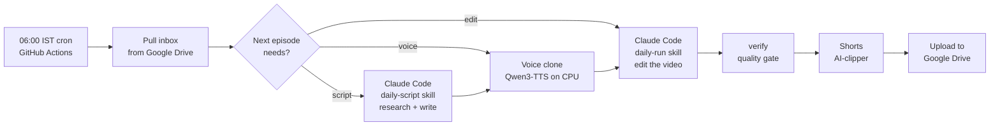
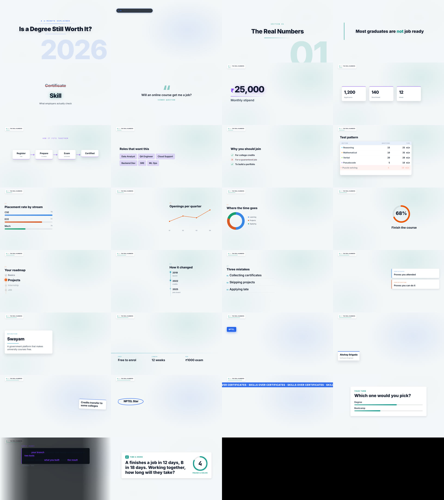
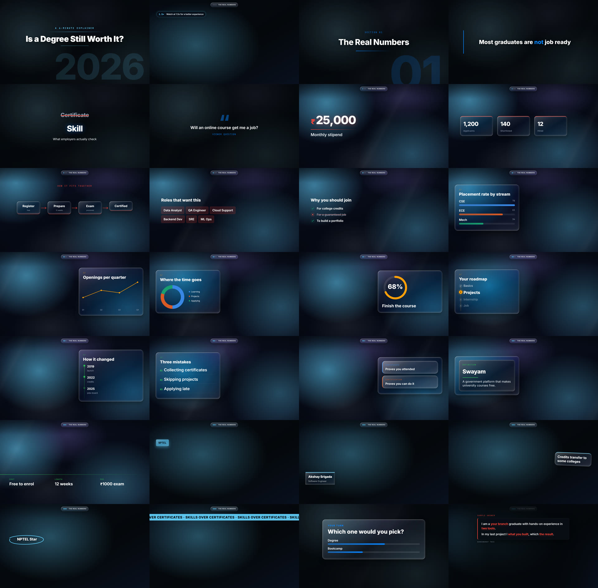

# AI Video Editor: an autonomous faceless YouTube pipeline

An AI agent that runs a faceless YouTube channel end to end. Every morning a GitHub Actions run picks the next episode
and does the following:

1. Researches the day's news for the channel's audience and writes the script, or finishes a planned script.
2. Records the voiceover in the creator's **own cloned voice**.
3. Edits a finished 16:9 video with motion graphics, stock footage, news screenshots and sound design.
4. Cuts YouTube Shorts from it.
5. Writes the upload metadata.

Everything lands in Google Drive, ready to post. It runs on free tiers (GitHub Actions and Google Drive); the only paid
part is a Claude subscription.

Built for **Crack IT**, a channel for engineering students and freshers moving from campus to their first IT job.

> Status: in daily use. The first fully automatic episode (voice → edit → Shorts → Drive) took **1 h 13 min** on a free
> 4-CPU GitHub runner, with no human involved.

---

## How it works



| Stage | What happens | Built with |
|---|---|---|
| **Plan** | Picks the first unfinished episode and works out what it still needs (`script`, `voice` or `edit`) | `tools/daily.mjs` |
| **Script** | Planned episodes come first: their `{FILL…}` figures are filled only from confirmed sources, and an episode is deferred if its numbers aren't out yet. With none left, Claude researches the last 48 h of news and writes a new episode in the house format | Claude Code skill `daily-script` |
| **Voice** | Voice clone from a short reference clip. The text goes paragraph by paragraph, and each chunk's length is checked against the expected speaking time and regenerated if words were dropped | Qwen3-TTS 0.6B (CPU), `tools/voice/tts.py` |
| **Edit** | Transcribe → clean cut (retakes, stumbles, dead air) → direction pass → visual plan → render → SFX mix → master at -14 LUFS → `verify` | Claude Code skills + Remotion + HyperFrames + ffmpeg |
| **Shorts** | Reads the whole transcript, picks self-contained moments, adds text hooks, renders 9:16 clips | `AI-clipper/` (Remotion, Python) |
| **Package** | Title options, description with chapters, tags, pinned comment, thumbnail text | Claude Code skill `youtube-metadata` |
| **Deliver** | Video, Shorts, metadata and reports go to Drive; the edit's decision files are committed back | rclone, GitHub Actions |

### Design choices

- **Decisions live in files, tools are re-runnable.** Every stage writes JSON (`edl.json`, `visual-plan.json`,
  `audio-plan.json`), so a stage can be re-run or hand-corrected without redoing the rest.
- **The agent never asks; it reports.** Unattended runs write every judgment call to `daily-report.md` and
  `daily-script-report.md`, with the source link for every number shown on screen.
- **Quality gates before upload.** `verify` checks durations, audio streams, loudness, frozen frames and frames at
  every cut join. A script with a leftover placeholder fails the run before the voice reads it out loud.
- **Fact safety.** On-screen figures need an official source or two reputable outlets. Candidate reports are labelled
  as such. If a figure can't be confirmed, the run fails instead of publishing.
- **Lessons are memory.** Incidents that cost a render go into `docs/lessons.md`, which every run reads first.
- **Public repo, private data.** No media, voice sample or keys in git: keys live in GitHub Secrets, media and agent
  transcripts in Google Drive.

---

## Motion graphics

28 graphic types (stat counters, bar/line/donut charts, timelines, flow diagrams, checklists, comparison tables,
quote cards …) in five visual styles (`glass`, `broadcast`, `liquid`, `blueprint`, `cleantech`), each laid out for both
16:9 and 9:16.

| Cleantech 16:9 | Liquid 16:9 |
|---|---|
|  |  |

---

## Tech stack

- **Agent:** Claude Code with 11 project skills (`.claude/skills/`) covering editing, directing, captions, SFX,
  music, metadata, thumbnails and the two unattended daily skills
- **Video:** Remotion 4 (React + TypeScript), HyperFrames (word-synced captions), ffmpeg
- **Speech:** whisper.cpp `small.en` (local speech-to-text), ElevenLabs Scribe (Telugu, Hindi, code-mixed),
  Qwen3-TTS (voice clone)
- **Media sources:** Pexels / Pixabay (stock), Openverse (CC music and SFX), headless Chrome (news screenshots)
- **Automation:** GitHub Actions (cron + manual dispatch), rclone + Google Drive
- **Code:** Node.js 22 ESM with no runtime dependencies (`tools/`), Python (TTS, Shorts pipeline), TypeScript

## Repository layout

```
.claude/skills/        agent skills: edit-video, edit-video-faceless, clean-cut, motion-graphics, captions, sfx,
                       bgm, youtube-metadata, youtube-thumbnail, daily-script, daily-run
.github/workflows/     daily-edit.yml: the unattended daily episode
tools/                 pipeline CLIs (transcribe, cut, visuals, mix, finalize, verify, daily, …)
tools/voice/tts.py     voice clone for the daily run
remotion/              the video renderer: scenes, 28 overlay components, 5 styles, thumbnails
hyperframes/           caption pass
AI-clipper/            long video → YouTube Shorts
config/                standing brief, brand profile, voice settings, daily state
docs/                  cloud setup, lessons learned, script format example
projects/<episode>/    per-episode decision files (media is git-ignored)
```

## Run it

**Manually** (one video from your own voiceover; needs Node 22, ffmpeg and whisper.cpp, see `tools/lib/whisper.mjs`):

```bash
npm install && (cd remotion && npm install) && (cd hyperframes && npm install)
npm run new -- inbox/faceless/my-voiceover.wav --mode faceless --brief "calm documentary, 16:9"
# then ask Claude Code: "edit faceless using my-voiceover"
```

**Daily and unattended:** follow [docs/cloud-setup.md](docs/cloud-setup.md). It covers the Drive folder, the rclone
login, GitHub secrets and the voice reference. After that it runs every day at 06:00 IST, or on demand from
**Actions → Daily edit → Run workflow**.

---

**Author:** Srigada Akshay Kumar ([@SrigadaAkshayKumar](https://github.com/SrigadaAkshayKumar))
